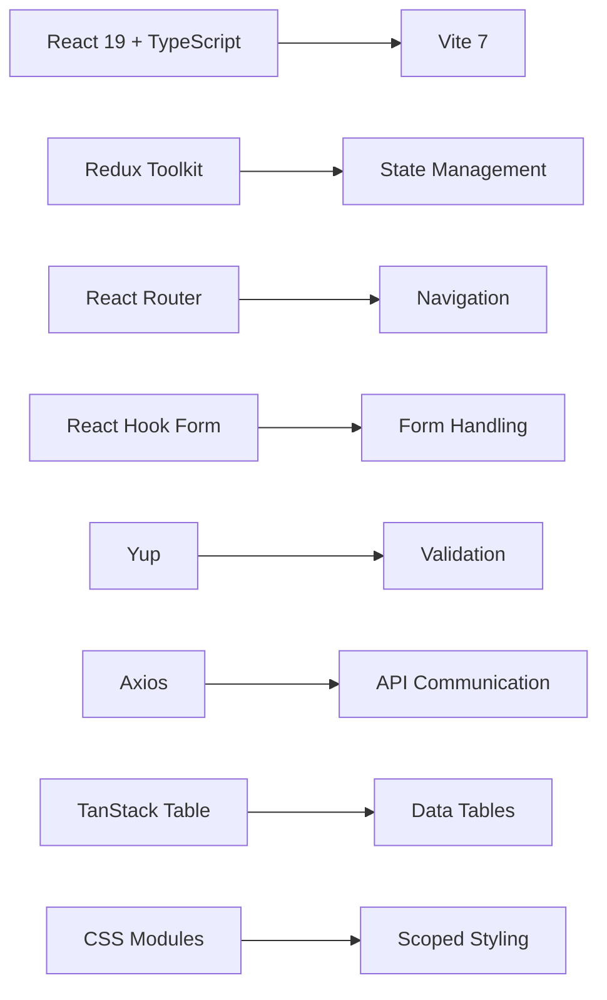
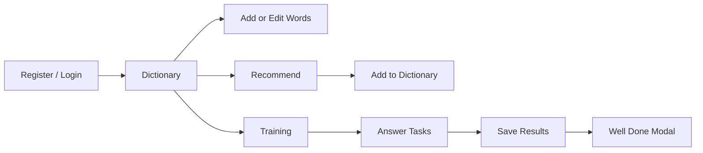

# 📚 Vocab Builder

<div align="center">


### 🚀 Build your vocabulary, one word at a time

[Features](#-features) •
[Tech Stack](#-tech-stack) •
[Getting Started](#-getting-started) •
[Project Structure](#-project-structure)

</div>

---

## ✨ Features

|     |                                                                              |
| --- | ---------------------------------------------------------------------------- |
| 🔐  | **Authentication** — Register, login, and protected routes                   |
| 📖  | **Dictionary Management** — Add, edit, and delete words                      |
| 💡  | **Smart Recommendations** — Discover new words and add instantly             |
| 🎯  | **Interactive Training** — Practice with progress tracking and final results |
| 📱  | **Responsive Design** — Optimized for mobile, tablet, and desktop            |
| 🔔  | **Global Notifications** — Real-time success/error/info feedback             |

## 🛠️ Tech Stack



### Core Dependencies

- ⚛️ React 19 with TypeScript
- ⚡ Vite 7 for fast dev/build experience
- 🗃️ Redux Toolkit for state management
- 🚦 React Router for app navigation
- 📝 React Hook Form + Yup for forms and validation
- 🌐 Axios for API calls
- 📊 TanStack React Table for dictionary/recommend tables
- 🎨 CSS Modules for component-scoped styles

## 📂 Project Structure

```text
src/
├── app/                 # routes, layouts, app shell
├── components/          # reusable UI components
│   ├── common/          # shared UI (inputs, notifications, tables, etc.)
│   ├── dashboard/       # dashboard blocks (filters, stats, actions)
│   ├── forms/           # login/register/add/edit forms
│   ├── header/          # top navigation and user controls
│   ├── modals/          # add/edit/well-done modals
│   └── training/        # training room UI
├── hooks/               # custom hooks
├── pages/               # route pages
├── services/            # API layer
├── store/               # Redux store and slices
├── styles/              # global styles and tokens
├── types/               # TypeScript domain types
└── utils/               # helper utilities
```

## 🚀 Getting Started

### Prerequisites

- Node.js 18+
- npm

### 1) Install dependencies

```bash
npm install
```

### 2) Configure environment

Create a `.env` file in the project root:

```bash
VITE_API_URL=https://your-api-url
VITE_USE_CREDENTIALS=false
```

### 3) Run development server

```bash
npm run dev
```

### 4) Build and preview production

```bash
npm run build
npm run preview
```

## 🧭 Application Routes

### Public

- `/login` — Sign in
- `/register` — Create account

### Protected

- `/dictionary` — Manage your own words
- `/recommend` — Browse recommended words
- `/training` — Practice and track progress

## 💫 User Flow



## 📜 Available Scripts

| Command           | Description                         |
| ----------------- | ----------------------------------- |
| `npm run dev`     | Start Vite development server       |
| `npm run build`   | Type-check and build for production |
| `npm run preview` | Preview production build locally    |
| `npm run lint`    | Run ESLint                          |

## 🔧 Environment Variables

| Variable               | Description                     | Required |
| ---------------------- | ------------------------------- | -------- |
| `VITE_API_URL`         | Backend API base URL            | ✅       |
| `VITE_USE_CREDENTIALS` | Enable cookies/credentials mode | ❌       |

## 📝 License

Private project for educational and product development purposes.

## 📬 Contact

- 👤 **Serhii Haievoi**
- ✉️ [serhiihaievoi@gmail.com](mailto:serhiihaievoi@gmail.com)
- 📱 [+380930773039](tel:+380930773039)
- 💬 [Telegram](https://t.me/Gaevuha)
- 💻 [GitHub](https://github.com/Gaevuha)
- 🔗 [LinkedIn](https://www.linkedin.com/in/serhii-haievoi/)
